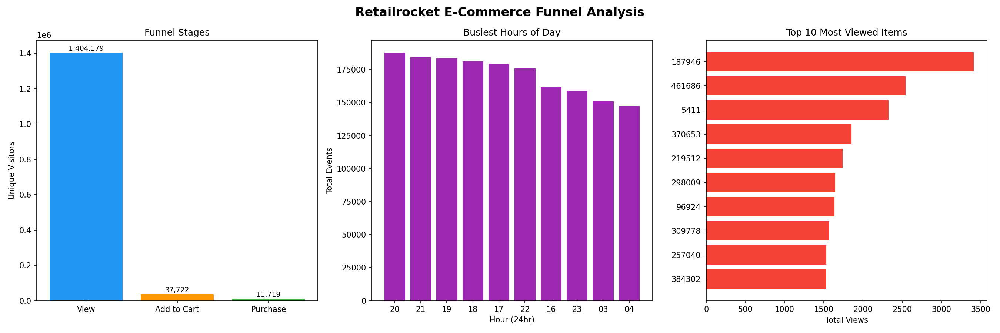

# E-Commerce Funnel Analysis — Retailrocket Dataset

I did this project to understand how users behave on an e-commerce platform 
and where they drop off before making a purchase.

## Why I did this project
As someone targeting product analyst roles, I wanted to work on a real 
dataset and answer business questions using SQL. This dataset had 2.7 million 
real user events which made it a good challenge.

## What I found
- Out of 1.4 million visitors, only 0.83% actually purchased something
- The biggest drop off is at the browsing stage — 97% of visitors leave 
  without even adding anything to cart
- Most shopping activity happens between 5PM and 9PM
- Item 187946 was the most viewed product with 3,410 views

## Questions I answered using SQL
1. How many unique visitors does the dataset have?
2. How many visitors reached each funnel stage?
3. Which products are viewed the most?
4. Which items get added to cart but never purchased?
5. What is the overall conversion rate?
6. Which hours of the day are busiest?
7. What are the drop off rates between each funnel stage?
8. How many visitors browsed but never bought anything?

## Tools I used
- SQL — to query and analyse the data
- DB Browser for SQLite — to run SQL queries
- Python with matplotlib — to visualize the funnel
- VS Code — to write the code
- GitHub — to share the project

## Files in this repo
- `queries.sql` — all 8 SQL queries I wrote
- `funnel_chart.py` — Python code for the charts
- `funnel_analysis_complete.png` — the final dashboard
- `setup_db.py` — loads the CSV into SQLite database

## How to Run

1. Download the dataset from Kaggle:  
   https://www.kaggle.com/datasets/retailrocket/ecommerce-dataset  
2. Place `events.csv` in this project folder (same folder as `setup_db.py`)
3. Install dependencies: `pip install pandas matplotlib`
4. Run `python setup_db.py` to create the database
5. Run `python funnel_chart.py` to generate the chart

## Dataset
Retailrocket E-Commerce Dataset from Kaggle  
Link: kaggle.com/datasets/retailrocket/ecommerce-dataset

